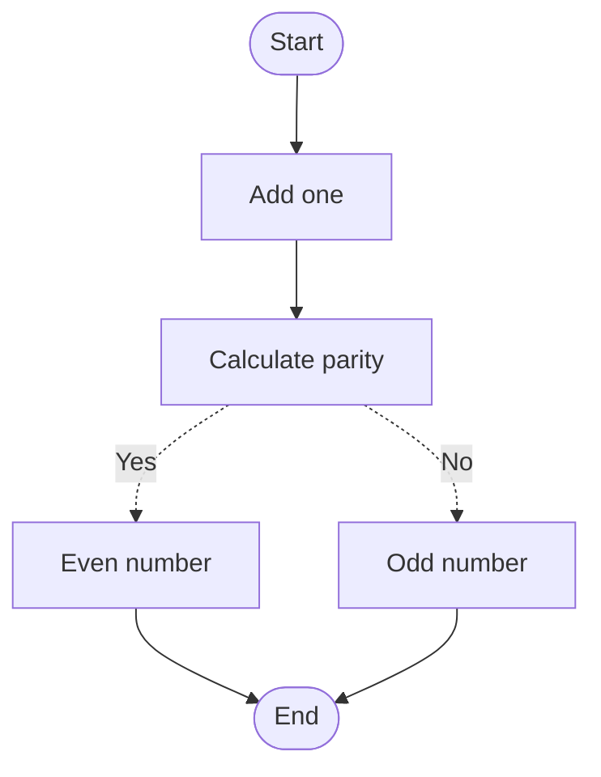

# Workflow Graph

A Python library for building and running directed graphs of operations, with support for both synchronous and asynchronous execution. It's a lightweight alternative to LangGraph with no dependencies other than the official [typing_extensions](https://typing-extensions.readthedocs.io).

## Features

- **Graph-based workflows**: Build flexible, directed workflows where nodes are customizable tasks
- **Synchronous & asynchronous support**: Define both sync and async nodes without any external dependencies
- **Type safety**: Built-in type validation ensures type consistency throughout the workflow
- **Error handling**: Configurable error handling and retry policies
- **Branching logic**: Support for conditional branches with async conditions
- **State management**: Proper state persistence between nodes
- **Callback support**: Configurable callbacks for monitoring execution progress
- **Generic types**: Support for generic types in workflow state
- **Cycle support**: By default, cycles are allowed. Use `enforce_acyclic=True` to enforce a DAG structure

## Installation

### From PyPI (recommended)

```bash
pip install workflow-graph
```

### Development Setup

1. Clone the repository:
```bash
git clone https://github.com/dextersjab/workflow-graph.git
cd workflow-graph
```

2. Create and activate a virtual environment:
```bash
python -m venv venv
source venv/bin/activate  # On Windows: venv\Scripts\activate
```

3. Install the package in development mode with all dependencies:
```bash
# Install with development tools (black, isort, flake8, mypy, pytest)
pip install -e ".[dev]"

# Install with example dependencies (pydantic)
pip install -e ".[dev,examples]"
```

4. Run the tests:
```bash
pytest
```

### Latest alpha/beta version

```bash
pip install workflow-graph --pre
```

> **Note**: The alpha/beta versions may include breaking changes as the API stabilizes.

### From GitHub

Add the following line to your `requirements.txt`:

```
git+https://github.com/dextersjab/workflow-graph.git@main
```

Then, run:

```bash
pip install -r requirements.txt
```

Or install directly using pip:

```bash
pip install git+https://github.com/dextersjab/workflow-graph.git@main
```

## Basic usage

### Implementing a workflow

Here's how to create a simple workflow with state management and conditional paths:

```python
from workflow_graph import WorkflowGraph, START, END, State

# Define your state class
NumberProcessingState = State[int]

# Define basic nodes that work with state
def add_one(state: NumberProcessingState) -> NumberProcessingState:
    return state.updated(value=state.value + 1)

def calculate_parity(state: NumberProcessingState) -> bool:
    return state

def even_number(state: NumberProcessingState) -> NumberProcessingState:
    return state.updated(value=f"{state.value} ==> Even")

def odd_number(state: NumberProcessingState) -> NumberProcessingState:
    return state.updated(value=f"{state.value} ==> Odd")

# Create the WorkflowGraph
workflow = WorkflowGraph()

# Add nodes to the graph
workflow.add_node("add_one", add_one)
workflow.add_node("calculate_parity", calculate_parity)
workflow.add_node("even_number", even_number)
workflow.add_node("odd_number", odd_number)

# Define edges for the main workflow
workflow.add_edge(START, "add_one")
workflow.add_edge("add_one", "calculate_parity")

# Define conditional edges based on whether the number is even or odd
workflow.add_conditional_edges(
    "calculate_parity", 
    lambda state: state.value % 2 == 0, 
    path_map={True: "even_number", False: "odd_number"}
)

# Set finish points
workflow.add_edge("even_number", END)
workflow.add_edge("odd_number", END)

# Execute the workflow
initial_state = NumberProcessingState(value=5)
result = workflow.execute(initial_state)
print(result.value)  # Output: "6 ==> Odd"
```

This example creates a workflow that:
1. Takes a number as input
2. Adds one to it
3. Checks if the result is even or odd
4. Branches to different handlers based on the result



### Async workflow

```python
import asyncio
from workflow_graph import WorkflowGraph, START, END, State

@dataclass
class NumberState(State[int]):
    """State for number processing workflow."""
    pass

async def async_operation(state: NumberState) -> NumberState:
    await asyncio.sleep(0.1)
    return state.updated(value=state.value + 1)

graph = WorkflowGraph()
graph.add_node("async_op", async_operation)
graph.add_edge(START, "async_op")
graph.add_edge("async_op", END)

initial_state = NumberState(value=1)
result = await graph.execute_async(initial_state)
assert result.value == 2
```

### Error handling and retries

WorkflowGraph supports built-in error handling and retry capabilities:

```python
def failing_operation(state: NumberState) -> NumberState:
    raise ValueError("Operation failed")

def error_handler(error: Exception, state: NumberState) -> NumberState:
    return state.updated(value=-1).add_error(error, "failing_op")

graph = WorkflowGraph()
graph.add_node(
    "failing_op",
    failing_operation,
    retries=2,
    backoff_factor=0.1,
    error_handler=error_handler
)
graph.add_edge(START, "failing_op")
graph.add_edge("failing_op", END)

result = graph.execute(NumberState(value=1))
assert result.value == -1
assert len(result.errors) > 0
```

### Real-time streaming with callbacks

```python
def process_data(state: NumberState) -> NumberState:
    return state.updated(value=state.value * 10)

def callback(result: NumberState):
    print(f"Processed result: {result.value}")

graph = WorkflowGraph()
graph.add_node("process", process_data, callback=callback)
graph.add_edge(START, "process")
graph.add_edge("process", END)

graph.execute(NumberState(value=5))  # Prints: Processed result: 50
```

### Generating Mermaid diagrams

WorkflowGraph includes built-in support for generating [Mermaid](https://mermaid.js.org/) diagrams to visualise your workflow:

```python
# Generate Mermaid diagram code
mermaid_code = graph.to_mermaid()
print(mermaid_code)
```

The generated diagram follows the convention of using dashed lines (`-.->`), rather than decision nodes, to represent conditional branches. This provides a cleaner and more accurate representation of how the workflow behaves.

Mermaid diagrams can be rendered in:
- GitHub Markdown (just paste the code)
- VS Code (with the Mermaid extension)
- Web browsers (using the Mermaid Live Editor)
- Many other tools that support Mermaid

## Package structure

The library is organised into the following modules:

- **workflow_graph**: Main package
- **constants.py**: Defines constants like START and END
- **models.py**: Defines data structures like NodeSpec and Branch
- **builder.py**: Contains the WorkflowGraph class for building graphs
- **executor.py**: Contains the CompiledGraph class for executing workflows
- **exceptions.py**: Contains custom exceptions for better error handling

## Contributing

Contributions are welcome! Please feel free to submit a Pull Request. For development guidelines, see [CONTRIBUTING.md](./CONTRIBUTING.md).

## License

This project is licensed under the MIT License - see the [LICENSE](./LICENSE) file for details.
