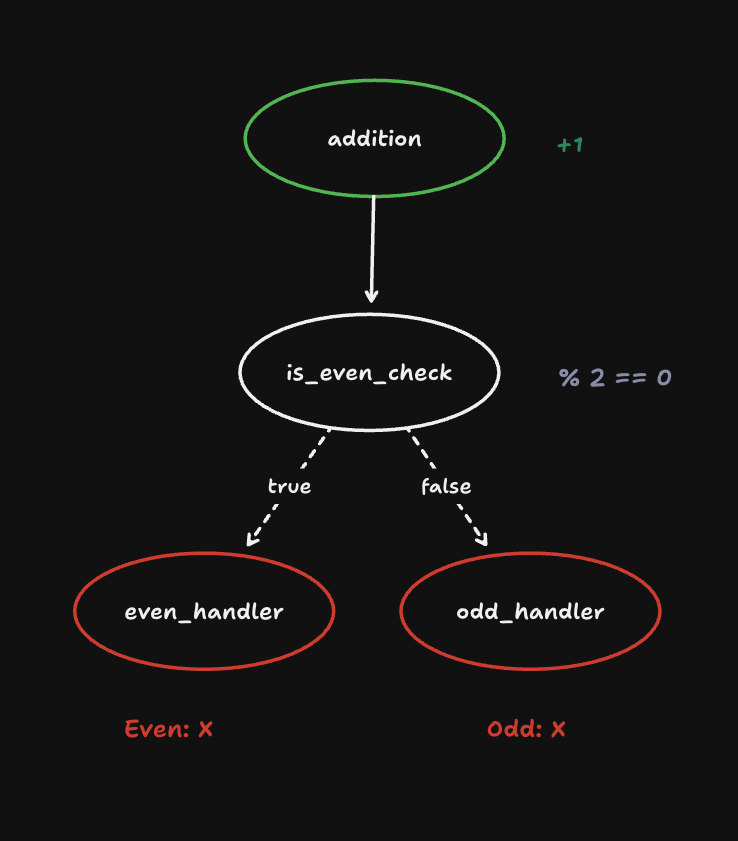

# WorkflowGraph

**WorkflowGraph** is a lightweight, self-contained Python library for building and executing directed graph workflows. It's an alternative to **LangGraph** for those seeking independence from LangChain and the flexibility to implement agent workflows, while still enabling real-time streaming of results.

## Features

- **Graph-based workflows**: Build flexible, directed workflows where nodes are customizable tasks.
- **Synchronous & asynchronous support**: Define both sync and async nodes without any external dependencies.
- **Real-time streaming**: Built-in support for callbacks in each node, allowing real-time token streaming (e.g., for WebSockets).
- **LangGraph alternative**: Unlike LangGraph, WorkflowGraph provides a simpler, fully self-contained solution without needing LangChain for streaming.
- **Modular architecture**: Organized into separate modules for better maintainability and extensibility.

## Installation

To install **WorkflowGraph** as a dependency, add the following line to your `requirements.txt`:

```
git+https://github.com/dextersjab/workflow-graph.git@main
```

Then, run:

```shell
pip install -r requirements.txt
```

Or install directly using pip:

```shell
pip install git+https://github.com/dextersjab/workflow-graph.git@main
```

## Basic Usage

### Implementing a Workflow

Here's how to create a simple workflow with conditional branching:

```python
import asyncio
from workflow_graph import WorkflowGraph

# Define task functions
def add(data, callback=None):
    result = data + 1
    if callback:
        callback(f"Added 1: {data} -> {result}")
    return result

def is_even(data, callback=None):
    result = data % 2 == 0
    if callback:
        callback(f"is_even: {data} -> {result}")
    return result

def handle_even(data, callback=None):
    if callback:
        callback(f"Handling even number: {data}")
    return f"Even: {data}"

def handle_odd(data, callback=None):
    if callback:
        callback(f"Handling odd number: {data}")
    return f"Odd: {data}"

# Create and configure the workflow graph
graph = WorkflowGraph()

# Add nodes
graph.add_node("addition", add)
graph.add_node("is_even_check", is_even)
graph.add_node("even_handler", handle_even)
graph.add_node("odd_handler", handle_odd)

# Define starting point
graph.set_entry_point("addition")

# Define flow between nodes
graph.add_edge("addition", "is_even_check")

# Add conditional branching based on is_even_check result
graph.add_conditional_edges(
    "is_even_check", 
    path=is_even, 
    path_map={True: "even_handler", False: "odd_handler"}
)

# Set endpoints
graph.set_finish_point("even_handler")
graph.set_finish_point("odd_handler")
```

This example creates a workflow that:
1. Takes a number as input
2. Adds 1 to it
3. Checks if the result is even
4. Branches to different handlers based on the result



### Error Handling and Retries

WorkflowGraph supports built-in error handling and retry capabilities:

```python
graph.add_node(
    "api_call", 
    make_api_request, 
    retries=3,                   # Retry up to 3 times on failure
    backoff_factor=0.5,          # Wait 0.5 seconds × attempt before retrying
    on_error=handle_api_error    # Call this function if all retries fail
)
```

## Execution Methods

Once your workflow is defined, there are two ways to execute it:

### Direct Execution (Simple)

For one-time executions, use the direct execution approach:

```python
# Execute synchronously
result = graph.execute(input_data)

# Or execute asynchronously with a callback
result = await graph.execute_async(input_data, callback=some_callback)
```

### Compile-then-Execute (More Efficient for Multiple Executions)

For workflows that will be executed multiple times, compile once and reuse:

```python
# Compile the graph
compiled_graph = graph.compile()

async def run_workflow(input_data):
    # Execute with the compiled graph
    result = await compiled_graph.execute_async(input_data, callback=print)
    print(f"Final Result: {result}")

# Run the workflow with different inputs
asyncio.run(run_workflow(5))
asyncio.run(run_workflow(10))
```

## Package Structure

The library is organized into the following modules:

- **workflow_graph**: Main package
  - **constants.py**: Defines constants like START and END
  - **models.py**: Defines data structures like NodeSpec and Branch
  - **builder.py**: Contains the WorkflowGraph class for building graphs
  - **executor.py**: Contains the CompiledGraph class for executing workflows
  - **exceptions.py**: Contains custom exceptions for better error handling

For backward compatibility, a top-level `workflow_graph.py` file is also provided that re-exports all the public API.
